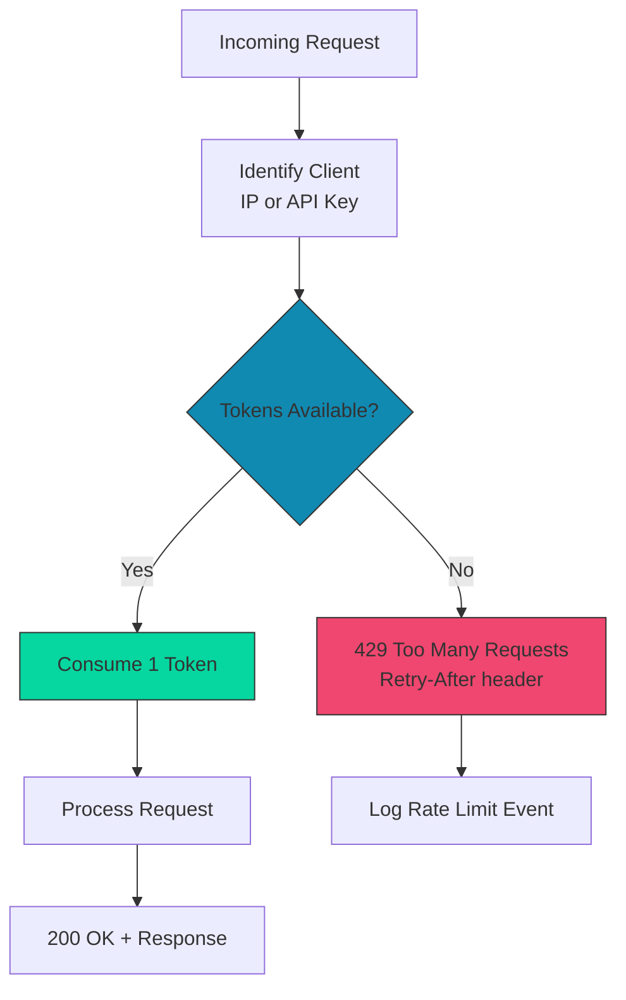
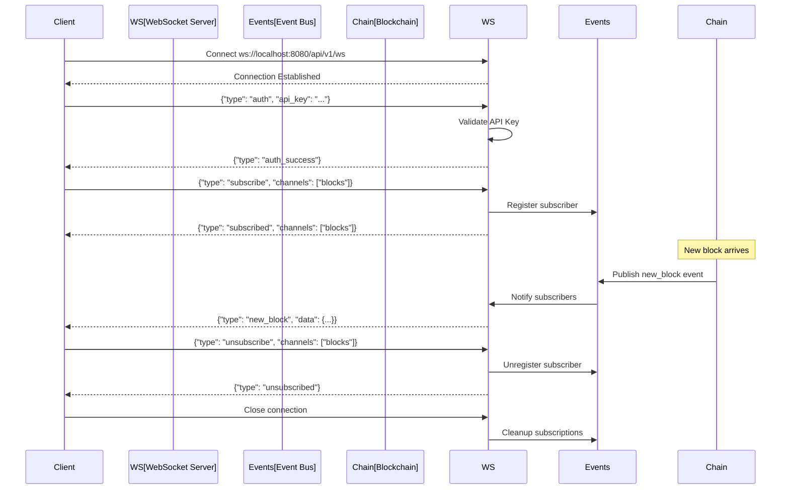

# COINjecture API Reference

**Version:** 4.0.0
**Last Updated:** 2025-11-04
**Base URL:** `http://localhost:8080/api/v1`
**Protocol:** REST (JSON)

---

## Table of Contents

1. [Overview](#overview)
2. [Authentication](#authentication)
3. [Rate Limiting](#rate-limiting)
4. [Error Handling](#error-handling)
5. [Endpoints](#endpoints)
6. [WebSocket API](#websocket-api)
7. [SDK Examples](#sdk-examples)
8. [OpenAPI Specification](#openapi-specification)

---

## Overview

The COINjecture REST API provides programmatic access to:

- **Blockchain Data** - Query blocks, transactions, accounts
- **Mining Operations** - Submit blocks, check mining stats
- **Network Status** - Peer info, sync status, health checks
- **Node Management** - Configuration, metrics, diagnostics

### API Design Principles

✅ **RESTful** - Standard HTTP methods (GET, POST, PUT, DELETE)
✅ **JSON-First** - All requests and responses use JSON
✅ **Versioned** - API version in URL path (`/api/v1/`)
✅ **Paginated** - Large result sets use cursor-based pagination
✅ **Rate Limited** - Prevent abuse, ensure fair access
✅ **Well-Documented** - OpenAPI 3.1 specification included

### Request Flow

```mermaid
sequenceDiagram
    participant Client
    participant API[API Gateway<br/>Port 8080]
    participant RateLimit[Rate Limiter]
    participant Auth[Auth Middleware]
    participant Handler[Request Handler]
    participant Core[Consensus Core]

    Client->>API: HTTP Request<br/>GET /api/v1/blocks/12345
    API->>RateLimit: Check Rate Limit

    alt Rate Limit Exceeded
        RateLimit-->>Client: 429 Too Many Requests
    else Within Limit
        RateLimit->>Auth: Verify API Key (if required)

        alt Invalid/Missing Key
            Auth-->>Client: 401 Unauthorized
        else Valid Key
            Auth->>Handler: Route to Handler
            Handler->>Core: Query Block Data
            Core-->>Handler: Block Object
            Handler->>Handler: Serialize to JSON
            Handler-->>Client: 200 OK + JSON Response
        end
    end

    Note over Client,Core: All responses include<br/>X-RateLimit-* headers
```

---

## Authentication

### API Key Authentication

**Required for:**
- Write operations (POST, PUT, DELETE)
- Administrative endpoints
- High-rate-limit tier access

**Not required for:**
- Read operations (GET) - public data
- Health checks
- Status endpoints

### Obtaining an API Key

```bash
# Generate API key
coinjectured api-key generate --name "my-app"

# Output:
# API Key Generated:
#   Name: my-app
#   Key: cjt_1234567890abcdef1234567890abcdef
#   Created: 2025-11-04T10:00:00Z
#   Rate Limit: 1000 req/min
#
# Store this key securely! It cannot be retrieved later.
```

### Using the API Key

**Header (Recommended):**
```bash
curl -H "X-API-Key: cjt_1234567890abcdef..." \
  http://localhost:8080/api/v1/blocks
```

**Query Parameter (Not recommended - visible in logs):**
```bash
curl http://localhost:8080/api/v1/blocks?api_key=cjt_1234...
```

### Key Management

```bash
# List all keys
coinjectured api-key list

# Revoke key
coinjectured api-key revoke --name "my-app"

# Rotate key (generate new, revoke old)
coinjectured api-key rotate --name "my-app"
```

---

## Rate Limiting

### Rate Limit Tiers

| Tier | Requests/Minute | Authentication | Use Case |
|------|-----------------|----------------|----------|
| **Anonymous** | 60 | None | Public queries |
| **Authenticated** | 1000 | API Key | Application integrations |
| **Premium** | 10000 | API Key + Premium | High-volume services |
| **Unlimited** | ∞ | Localhost only | Node operators |

### Rate Limit Headers

Every response includes:

```http
X-RateLimit-Limit: 1000
X-RateLimit-Remaining: 987
X-RateLimit-Reset: 1699142460
```

### Rate Limit Exceeded Response

```http
HTTP/1.1 429 Too Many Requests
Content-Type: application/json
Retry-After: 60

{
  "error": {
    "code": "RATE_LIMIT_EXCEEDED",
    "message": "Rate limit exceeded. Try again in 60 seconds.",
    "details": {
      "limit": 1000,
      "window_seconds": 60,
      "retry_after_seconds": 60
    }
  }
}
```

### Rate Limit Algorithm



**Token Bucket Parameters:**
- **Capacity:** Max requests per window (e.g., 1000)
- **Refill Rate:** Tokens added per second (e.g., 16.67 = 1000/60)
- **Burst Allowed:** Use full capacity immediately if available

---

## Error Handling

### Standard Error Response

```json
{
  "error": {
    "code": "ERROR_CODE",
    "message": "Human-readable error message",
    "details": {
      "field": "Additional context"
    },
    "request_id": "req_abc123",
    "timestamp": 1699142400
  }
}
```

### HTTP Status Codes

| Code | Meaning | When Used |
|------|---------|-----------|
| **200** | OK | Successful request |
| **201** | Created | Resource created (e.g., block submitted) |
| **400** | Bad Request | Invalid request format/parameters |
| **401** | Unauthorized | Missing or invalid API key |
| **403** | Forbidden | Valid auth but insufficient permissions |
| **404** | Not Found | Resource doesn't exist |
| **409** | Conflict | Resource already exists / state conflict |
| **422** | Unprocessable Entity | Valid format but semantic errors |
| **429** | Too Many Requests | Rate limit exceeded |
| **500** | Internal Server Error | Server-side error |
| **503** | Service Unavailable | Node syncing / maintenance |

### Error Codes

| Code | HTTP | Description | Action |
|------|------|-------------|--------|
| `INVALID_REQUEST` | 400 | Malformed JSON/parameters | Fix request format |
| `AUTHENTICATION_REQUIRED` | 401 | API key missing | Provide API key |
| `INVALID_API_KEY` | 401 | API key invalid/expired | Generate new key |
| `PERMISSION_DENIED` | 403 | Insufficient permissions | Request higher tier |
| `RESOURCE_NOT_FOUND` | 404 | Block/account not found | Check resource ID |
| `BLOCK_ALREADY_EXISTS` | 409 | Duplicate block submission | Skip (already processed) |
| `INVALID_BLOCK` | 422 | Block failed validation | Check block structure |
| `RATE_LIMIT_EXCEEDED` | 429 | Too many requests | Wait and retry |
| `NODE_SYNCING` | 503 | Node not fully synced | Wait for sync completion |
| `INTERNAL_ERROR` | 500 | Unexpected server error | Report bug if persistent |

### Error Handling Best Practices

```javascript
// Example: Robust API client with retry logic
async function fetchBlock(blockIndex) {
  const maxRetries = 3;
  let attempt = 0;

  while (attempt < maxRetries) {
    try {
      const response = await fetch(
        `http://localhost:8080/api/v1/blocks/${blockIndex}`,
        {
          headers: {
            'X-API-Key': process.env.COINJECTURE_API_KEY
          }
        }
      );

      if (response.ok) {
        return await response.json();
      }

      if (response.status === 429) {
        // Rate limited - exponential backoff
        const retryAfter = parseInt(response.headers.get('Retry-After') || '60');
        await sleep(retryAfter * 1000 * Math.pow(2, attempt));
        attempt++;
        continue;
      }

      if (response.status === 503) {
        // Node syncing - wait and retry
        await sleep(10000);
        attempt++;
        continue;
      }

      if (response.status === 404) {
        // Block doesn't exist (yet)
        return null;
      }

      // Other errors - throw
      const error = await response.json();
      throw new Error(`API Error: ${error.error.message}`);

    } catch (err) {
      if (attempt === maxRetries - 1) throw err;
      attempt++;
    }
  }
}
```

---

## Endpoints

### Health & Status

#### `GET /api/v1/health`

**Description:** Check API and node health

**Auth Required:** No

**Response:**
```json
{
  "status": "healthy",
  "components": {
    "consensus": "ok",
    "p2p": "ok",
    "ipfs": "ok",
    "database": "ok"
  },
  "timestamp": 1699142400
}
```

**Status Values:**
- `healthy` - All components operational
- `degraded` - Some components unhealthy but core functionality works
- `unhealthy` - Critical components down

---

#### `GET /api/v1/status`

**Description:** Get detailed node status

**Auth Required:** No

**Response:**
```json
{
  "version": "4.0.0",
  "uptime_seconds": 86400,
  "block_height": 12345,
  "best_block_hash": "0xabc123...",
  "sync_status": "synced",
  "sync_progress": 1.0,
  "peer_count": 8,
  "mempool_size": 3,
  "network": {
    "chain_id": "coinjecture-mainnet",
    "genesis_hash": "0x000000..."
  },
  "consensus": {
    "codec_mode": "refactored_only",
    "hardware_tier": "desktop"
  },
  "timestamp": 1699142400
}
```

**Sync Status Values:**
- `syncing` - Downloading blocks from peers
- `synced` - Up to date with network
- `stale` - Behind by > 10 blocks (may need resync)

---

### Blocks

#### `GET /api/v1/blocks/{block_index}`

**Description:** Get block by index

**Auth Required:** No

**Parameters:**
- `block_index` (path, integer) - Block height

**Response:**
```json
{
  "header": {
    "codec_version": 1,
    "block_index": 12345,
    "timestamp": 1699142400,
    "parent_hash": "0xabc123...",
    "merkle_root": "0xdef456...",
    "miner_address": "0x1234567890abcdef...",
    "commitment": "0xfedcba...",
    "difficulty_target": 1000000,
    "nonce": 42,
    "extra_data": ""
  },
  "transactions": [],
  "reveal": {
    "problem": {
      "problem_type": "subset_sum",
      "tier": "desktop",
      "elements": [1, 2, 3, 4, 5, 6, 7, 8, 9, 10, 11, 12, 13, 14],
      "target": 45,
      "timestamp": 1699142395
    },
    "solution": {
      "indices": [1, 3, 5, 7, 9, 11, 13],
      "timestamp": 1699142399
    },
    "miner_salt": "0xsecret...",
    "nonce": 42
  },
  "cid": "QmYwAPJzv5CZsnA625s3Xf2nemtYgPpHdWEz79ojWnPbdG",
  "size_bytes": 4096,
  "validation_time_ms": 12.3
}
```

**Errors:**
- `404` - Block not found

---

#### `GET /api/v1/blocks/latest`

**Description:** Get latest block

**Auth Required:** No

**Response:** Same as `GET /api/v1/blocks/{block_index}`

---

#### `GET /api/v1/blocks`

**Description:** List blocks (paginated)

**Auth Required:** No

**Query Parameters:**
- `start_index` (integer, optional) - Starting block index (default: latest)
- `limit` (integer, optional) - Max blocks to return (default: 20, max: 100)
- `order` (string, optional) - `asc` or `desc` (default: `desc`)

**Response:**
```json
{
  "blocks": [
    { /* Block object */ },
    { /* Block object */ },
    ...
  ],
  "pagination": {
    "start_index": 12345,
    "limit": 20,
    "total_blocks": 12345,
    "has_more": true,
    "next_cursor": 12325
  }
}
```

---

#### `POST /api/v1/blocks`

**Description:** Submit a new block (mining)

**Auth Required:** Yes

**Request Body:**
```json
{
  "header": {
    "codec_version": 1,
    "block_index": 12346,
    "timestamp": 1699142460,
    "parent_hash": "0xabc123...",
    "merkle_root": "0x000000...",
    "miner_address": "0x1234567890abcdef...",
    "commitment": "0xnewcommit...",
    "difficulty_target": 1000000,
    "nonce": 73,
    "extra_data": ""
  },
  "transactions": [],
  "reveal": {
    "problem": { /* Problem object */ },
    "solution": { /* Solution object */ },
    "miner_salt": "0xsecret...",
    "nonce": 73
  }
}
```

**Response (201 Created):**
```json
{
  "status": "accepted",
  "block_index": 12346,
  "block_hash": "0xnewhash...",
  "cid": "QmNewBlock...",
  "quorum_manifest": {
    "pins": [
      {"node": "ipfs-1", "timestamp": 1699142461},
      {"node": "ipfs-2", "timestamp": 1699142462},
      {"node": "ipfs-3", "timestamp": 1699142463}
    ],
    "quorum_met": true
  },
  "timestamp": 1699142460
}
```

**Errors:**
- `400` - Invalid block format
- `409` - Block already exists
- `422` - Block failed validation (e.g., invalid solution, commitment mismatch)
- `503` - IPFS pin quorum failed

---

### Accounts

#### `GET /api/v1/accounts/{address}`

**Description:** Get account information

**Auth Required:** No

**Parameters:**
- `address` (path, string) - Account address (0x-prefixed hex)

**Response:**
```json
{
  "address": "0x1234567890abcdef...",
  "balance": "2100.0",
  "pending_balance": "50.0",
  "nonce": 42,
  "blocks_mined": 84,
  "total_rewards": "4200.0",
  "created_at": 1699000000,
  "last_active": 1699142400
}
```

**Errors:**
- `404` - Account not found

---

#### `GET /api/v1/accounts/{address}/balance`

**Description:** Get account balance only (lightweight)

**Auth Required:** No

**Response:**
```json
{
  "address": "0x1234567890abcdef...",
  "balance": "2100.0",
  "pending_balance": "50.0"
}
```

---

#### `GET /api/v1/accounts/{address}/blocks`

**Description:** List blocks mined by address

**Auth Required:** No

**Query Parameters:**
- `limit` (integer, optional) - Max blocks (default: 20, max: 100)
- `cursor` (string, optional) - Pagination cursor

**Response:**
```json
{
  "address": "0x1234567890abcdef...",
  "blocks": [
    {
      "block_index": 12345,
      "timestamp": 1699142400,
      "reward": "50.0",
      "cid": "Qm..."
    },
    ...
  ],
  "pagination": {
    "cursor": "next_page_token",
    "has_more": true
  }
}
```

---

### Mining

#### `GET /api/v1/mining/stats`

**Description:** Get mining statistics (requires miner to be configured)

**Auth Required:** Yes (or localhost)

**Response:**
```json
{
  "enabled": true,
  "miner_address": "0x1234567890abcdef...",
  "hardware_tier": "desktop",
  "uptime_seconds": 3600,
  "stats": {
    "blocks_mined": 3,
    "attempts": 1247,
    "success_rate": 0.0024,
    "avg_solve_time_seconds": 187.3,
    "last_block_index": 12345,
    "last_block_time": 1699142400
  },
  "performance": {
    "problems_per_second": 5.2,
    "solutions_per_hour": 0.8
  },
  "rewards": {
    "total_earned": "150.0",
    "pending": "50.0",
    "confirmed": "100.0"
  }
}
```

---

#### `POST /api/v1/mining/start`

**Description:** Start mining

**Auth Required:** Yes

**Request Body:**
```json
{
  "miner_address": "0x1234567890abcdef...",
  "hardware_tier": "desktop"
}
```

**Response:**
```json
{
  "status": "started",
  "miner_address": "0x1234567890abcdef...",
  "tier": "desktop"
}
```

---

#### `POST /api/v1/mining/stop`

**Description:** Stop mining

**Auth Required:** Yes

**Response:**
```json
{
  "status": "stopped",
  "final_stats": {
    "blocks_mined": 42,
    "uptime_seconds": 86400,
    "total_rewards": "2100.0"
  }
}
```

---

### Network

#### `GET /api/v1/network/peers`

**Description:** List connected peers

**Auth Required:** No

**Response:**
```json
{
  "peer_count": 8,
  "peers": [
    {
      "peer_id": "12D3KooW...",
      "addresses": ["/ip4/192.168.1.10/tcp/4001"],
      "connected_since": 1699000000,
      "direction": "outbound",
      "latency_ms": 23,
      "score": 95.5
    },
    ...
  ]
}
```

---

#### `GET /api/v1/network/sync`

**Description:** Get sync progress

**Auth Required:** No

**Response:**
```json
{
  "sync_status": "syncing",
  "current_block": 10000,
  "target_block": 12345,
  "progress": 0.81,
  "blocks_per_second": 15.3,
  "estimated_time_remaining_seconds": 153
}
```

---

### Metrics

#### `GET /metrics`

**Description:** Prometheus metrics endpoint

**Auth Required:** No (but can be configured)

**Response:** Prometheus text format

```
# HELP coinjecture_block_height_current Current blockchain height
# TYPE coinjecture_block_height_current gauge
coinjecture_block_height_current 12345

# HELP coinjecture_peer_count Number of connected peers
# TYPE coinjecture_peer_count gauge
coinjecture_peer_count 8

# HELP coinjecture_validation_duration_seconds Block validation time
# TYPE coinjecture_validation_duration_seconds histogram
coinjecture_validation_duration_seconds_bucket{le="0.01"} 1234
coinjecture_validation_duration_seconds_bucket{le="0.05"} 5678
...
```

See [SLO.md](SLO.md) for complete metrics catalog.

---

## WebSocket API

### Connection

```javascript
const ws = new WebSocket('ws://localhost:8080/api/v1/ws');

ws.onopen = () => {
  // Authenticate
  ws.send(JSON.stringify({
    type: 'auth',
    api_key: 'cjt_1234...'
  }));

  // Subscribe to events
  ws.send(JSON.stringify({
    type: 'subscribe',
    channels: ['blocks', 'mining']
  }));
};

ws.onmessage = (event) => {
  const message = JSON.parse(event.data);
  console.log('Received:', message);
};
```

### Events

#### `new_block`

```json
{
  "type": "new_block",
  "data": {
    "block_index": 12346,
    "block_hash": "0xabc123...",
    "miner_address": "0x1234...",
    "timestamp": 1699142460,
    "cid": "Qm..."
  }
}
```

#### `mining_solution_found`

```json
{
  "type": "mining_solution_found",
  "data": {
    "block_index": 12346,
    "solve_time_seconds": 187.3,
    "attempts": 1523
  }
}
```

#### `sync_progress`

```json
{
  "type": "sync_progress",
  "data": {
    "current_block": 11000,
    "target_block": 12345,
    "progress": 0.89
  }
}
```

### WebSocket Flow



---

## SDK Examples

### Python SDK

```python
from coinjecture import COINjectureClient

# Initialize client
client = COINjectureClient(
    base_url="http://localhost:8080",
    api_key="cjt_1234567890abcdef..."
)

# Get node status
status = client.get_status()
print(f"Block height: {status.block_height}")
print(f"Peers: {status.peer_count}")

# Get latest block
block = client.get_latest_block()
print(f"Block {block.header.block_index}: {block.cid}")

# Get account balance
balance = client.get_account_balance("0x1234...")
print(f"Balance: {balance.balance} CONJ")

# Stream new blocks (WebSocket)
@client.on_event('new_block')
def handle_new_block(block):
    print(f"New block: {block.block_index}")

client.subscribe(['blocks', 'mining'])
client.run()  # Blocks and listens for events
```

**Installation:**
```bash
pip install coinjecture-sdk
```

---

### JavaScript SDK

```javascript
const { COINjectureClient } = require('coinjecture-sdk');

// Initialize client
const client = new COINjectureClient({
  baseUrl: 'http://localhost:8080',
  apiKey: 'cjt_1234567890abcdef...'
});

// Get node status
const status = await client.getStatus();
console.log(`Block height: ${status.blockHeight}`);

// Get latest block
const block = await client.getLatestBlock();
console.log(`Block ${block.header.blockIndex}: ${block.cid}`);

// Get account balance
const account = await client.getAccount('0x1234...');
console.log(`Balance: ${account.balance} CONJ`);

// Stream new blocks (WebSocket)
client.on('new_block', (block) => {
  console.log(`New block: ${block.blockIndex}`);
});

await client.subscribe(['blocks', 'mining']);
```

**Installation:**
```bash
npm install coinjecture-sdk
```

---

### Go SDK

```go
package main

import (
    "fmt"
    "github.com/Quigles1337/coinjecture-go-sdk"
)

func main() {
    // Initialize client
    client := coinjecture.NewClient(&coinjecture.Config{
        BaseURL: "http://localhost:8080",
        APIKey:  "cjt_1234567890abcdef...",
    })

    // Get node status
    status, err := client.GetStatus()
    if err != nil {
        panic(err)
    }
    fmt.Printf("Block height: %d\n", status.BlockHeight)

    // Get latest block
    block, err := client.GetLatestBlock()
    if err != nil {
        panic(err)
    }
    fmt.Printf("Block %d: %s\n", block.Header.BlockIndex, block.CID)

    // Stream new blocks (WebSocket)
    events := make(chan *coinjecture.Event)
    go client.Subscribe([]string{"blocks", "mining"}, events)

    for event := range events {
        switch event.Type {
        case "new_block":
            fmt.Printf("New block: %d\n", event.Data.BlockIndex)
        }
    }
}
```

**Installation:**
```bash
go get github.com/Quigles1337/coinjecture-go-sdk
```

---

### Rust SDK

```rust
use coinjecture_sdk::{Client, Config, Event};

#[tokio::main]
async fn main() -> Result<(), Box<dyn std::error::Error>> {
    // Initialize client
    let client = Client::new(Config {
        base_url: "http://localhost:8080".to_string(),
        api_key: Some("cjt_1234567890abcdef...".to_string()),
    });

    // Get node status
    let status = client.get_status().await?;
    println!("Block height: {}", status.block_height);

    // Get latest block
    let block = client.get_latest_block().await?;
    println!("Block {}: {}", block.header.block_index, block.cid);

    // Stream new blocks (WebSocket)
    let mut events = client.subscribe(vec!["blocks", "mining"]).await?;

    while let Some(event) = events.next().await {
        match event {
            Event::NewBlock { block_index, .. } => {
                println!("New block: {}", block_index);
            }
            _ => {}
        }
    }

    Ok(())
}
```

**Installation:**
```toml
[dependencies]
coinjecture-sdk = "4.0"
```

---

## OpenAPI Specification

### Download OpenAPI Spec

```bash
# Download OpenAPI 3.1 specification
curl http://localhost:8080/api/v1/openapi.json > coinjecture-api.json

# Or YAML format
curl http://localhost:8080/api/v1/openapi.yaml > coinjecture-api.yaml
```

### Generate Client from OpenAPI

```bash
# Generate Python client
openapi-generator-cli generate \
  -i coinjecture-api.json \
  -g python \
  -o ./coinjecture-python-client

# Generate TypeScript client
openapi-generator-cli generate \
  -i coinjecture-api.json \
  -g typescript-axios \
  -o ./coinjecture-ts-client

# Generate Go client
openapi-generator-cli generate \
  -i coinjecture-api.json \
  -g go \
  -o ./coinjecture-go-client
```

### OpenAPI Spec (Inline)

**Full specification:** See [openapi.yaml](../api/openapi.yaml)

**Excerpt:**

```yaml
openapi: 3.1.0
info:
  title: COINjecture API
  version: 4.0.0
  description: |
    Institutional-grade blockchain API implementing commit-reveal proof-of-work
    with NP-complete subset sum problems.
  contact:
    name: COINjecture Support
    email: api@coinjecture.io
    url: https://coinjecture.io
  license:
    name: Apache 2.0
    url: https://www.apache.org/licenses/LICENSE-2.0.html

servers:
  - url: http://localhost:8080/api/v1
    description: Local development
  - url: https://api.coinjecture.io/v1
    description: Production

security:
  - ApiKeyAuth: []

components:
  securitySchemes:
    ApiKeyAuth:
      type: apiKey
      in: header
      name: X-API-Key

  schemas:
    Block:
      type: object
      required:
        - header
        - transactions
        - reveal
        - cid
      properties:
        header:
          $ref: '#/components/schemas/BlockHeader'
        transactions:
          type: array
          items:
            $ref: '#/components/schemas/Transaction'
        reveal:
          $ref: '#/components/schemas/Reveal'
        cid:
          type: string
          description: IPFS CID
          example: "QmYwAPJzv5CZsnA625s3Xf2nemtYgPpHdWEz79ojWnPbdG"

    BlockHeader:
      type: object
      required:
        - codec_version
        - block_index
        - timestamp
        - parent_hash
        - merkle_root
        - miner_address
        - commitment
        - difficulty_target
        - nonce
      properties:
        codec_version:
          type: integer
          example: 1
        block_index:
          type: integer
          format: int64
          example: 12345
        timestamp:
          type: integer
          format: int64
          example: 1699142400
        parent_hash:
          type: string
          format: byte
          example: "0xabc123..."
        merkle_root:
          type: string
          format: byte
          example: "0xdef456..."
        miner_address:
          type: string
          format: byte
          example: "0x1234567890abcdef..."
        commitment:
          type: string
          format: byte
          example: "0xfedcba..."
        difficulty_target:
          type: integer
          format: int64
          example: 1000000
        nonce:
          type: integer
          format: int64
          example: 42
        extra_data:
          type: string
          format: byte
          default: ""

    Error:
      type: object
      required:
        - code
        - message
      properties:
        code:
          type: string
          example: "RESOURCE_NOT_FOUND"
        message:
          type: string
          example: "Block not found"
        details:
          type: object
          additionalProperties: true
        request_id:
          type: string
          example: "req_abc123"
        timestamp:
          type: integer
          format: int64
          example: 1699142400

paths:
  /health:
    get:
      summary: Health check
      operationId: getHealth
      tags:
        - Status
      responses:
        '200':
          description: Node is healthy
          content:
            application/json:
              schema:
                type: object
                properties:
                  status:
                    type: string
                    enum: [healthy, degraded, unhealthy]
                  components:
                    type: object
                    properties:
                      consensus:
                        type: string
                      p2p:
                        type: string
                      ipfs:
                        type: string
                      database:
                        type: string

  /blocks/{block_index}:
    get:
      summary: Get block by index
      operationId: getBlock
      tags:
        - Blocks
      parameters:
        - name: block_index
          in: path
          required: true
          schema:
            type: integer
            format: int64
      responses:
        '200':
          description: Block found
          content:
            application/json:
              schema:
                $ref: '#/components/schemas/Block'
        '404':
          description: Block not found
          content:
            application/json:
              schema:
                $ref: '#/components/schemas/Error'

  /blocks:
    post:
      summary: Submit new block
      operationId: submitBlock
      tags:
        - Blocks
      security:
        - ApiKeyAuth: []
      requestBody:
        required: true
        content:
          application/json:
            schema:
              $ref: '#/components/schemas/Block'
      responses:
        '201':
          description: Block accepted
          content:
            application/json:
              schema:
                type: object
                properties:
                  status:
                    type: string
                  block_index:
                    type: integer
                  block_hash:
                    type: string
                  cid:
                    type: string
        '422':
          description: Block validation failed
          content:
            application/json:
              schema:
                $ref: '#/components/schemas/Error'
```

---

## Additional Resources

### Interactive API Documentation

Visit the built-in Swagger UI:

```
http://localhost:8080/api/docs
```

Features:
- Try out endpoints directly in browser
- See request/response examples
- Download OpenAPI spec
- Generate code snippets

### API Versioning Policy

**Current Version:** v1
**Support Policy:**
- **v1** - Active development, backwards compatible within v1.x
- **v2** - Planned for Q2 2026 (breaking changes)

**Deprecation Process:**
1. New version announced 6 months in advance
2. Old version supported for 12 months after new version release
3. Deprecation warnings in response headers
4. Final sunset with 3-month notice

### Community SDKs

**Unofficial SDKs** (community-maintained):
- **Ruby:** `gem install coinjecture`
- **PHP:** `composer require coinjecture/sdk`
- **C#:** `dotnet add package COINjecture.SDK`

See [Community SDKs](https://github.com/coinjecture-sdk) for full list.

---

## Support

**API Issues:** https://github.com/Quigles1337/COINjecture1337-REFACTOR/issues
**API Docs:** https://docs.coinjecture.io/api
**Discord:** https://discord.gg/coinjecture (#api-support channel)

---

**Happy Building! 🚀**

---

**Document Control:**
- Version: 4.0.0
- Last Updated: 2025-11-04
- Next Review: 2026-02-04
- Maintainer: COINjecture API Team
