# COINjecture User Guide

**Version:** 4.0.0
**Last Updated:** 2025-11-04
**Audience:** Developers, Node Operators, System Integrators

---

## Table of Contents

1. [Introduction](#introduction)
2. [Quick Start](#quick-start)
3. [Installation](#installation)
4. [Core Concepts](#core-concepts)
5. [Running Your First Node](#running-your-first-node)
6. [Mining Guide](#mining-guide)
7. [Validation & Security](#validation--security)
8. [API Usage](#api-usage)
9. [Best Practices](#best-practices)
10. [Troubleshooting](#troubleshooting)
11. [Advanced Topics](#advanced-topics)

---

## Introduction

### What is COINjecture?

COINjecture is an **institutional-grade blockchain** implementing a novel **commit-reveal proof-of-work** mechanism based on NP-complete subset sum problems. Unlike traditional mining, COINjecture provides:

✅ **Deterministic Consensus** - Reproducible validation across all platforms
✅ **Hardware Fairness** - Five tiers from mobile to cluster computing
✅ **Anti-Grinding Protection** - HMAC commitment binding prevents epoch replay
✅ **IPFS Integration** - Decentralized storage with pin quorum
✅ **Bank-Grade Security** - 6-layer defense-in-depth architecture

### Architecture Overview


**Key Components:**
- **Rust Core** - Consensus-critical logic (types, codec, hashing, verification)
- **Go Daemon** - Operational layer (API, P2P, IPFS, rate limiting)
- **Python Shims** - Backwards compatibility with legacy v3.x codebase
- **IPFS** - Decentralized block storage with ≥2/3 pin quorum

---

## Quick Start

### 5-Minute Setup (Docker)

**Prerequisites:** Docker 20.10+

```bash
# 1. Pull the latest image
docker pull ghcr.io/quigles1337/coinjecture:v4.0.0

# 2. Run a full node
docker run -d \
  --name coinjecture-node \
  -p 8080:8080 \
  -p 4001:4001 \
  -v coinjecture-data:/data \
  ghcr.io/quigles1337/coinjecture:v4.0.0

# 3. Check node status
curl http://localhost:8080/api/v1/status

# Expected output:
# {
#   "status": "running",
#   "version": "4.0.0",
#   "block_height": 12345,
#   "peer_count": 8,
#   "sync_status": "synced"
# }
```

**Congratulations!** You're running a COINjecture full node. 🎉

---

## Installation

### From Source (Recommended for Developers)

#### Prerequisites

**System Requirements:**
- **OS:** Linux (Ubuntu 22.04+), macOS (13+), Windows (11+)
- **RAM:** 4GB minimum, 8GB recommended
- **Disk:** 50GB SSD (blockchain data grows ~1GB/month)
- **Network:** Stable internet connection (10 Mbps up/down)

**Development Tools:**
- **Rust:** 1.75+ (`rustup install stable`)
- **Go:** 1.21+ (`go version`)
- **Python:** 3.10+ (`python --version`)
- **Git:** 2.40+

#### Step 1: Clone Repository

```bash
git clone https://github.com/Quigles1337/COINjecture1337-REFACTOR.git
cd COINjecture1337-REFACTOR
```

#### Step 2: Build Rust Core

```bash
cd rust/coinjecture-core

# Install dependencies
cargo fetch

# Build release binary (optimized)
cargo build --release

# Run tests to verify
cargo test --release

# Expected: All tests passing ✓
```

**Build Output:**
```
target/release/libcoinjecture_core.so    (Linux)
target/release/libcoinjecture_core.dylib (macOS)
target/release/coinjecture_core.dll      (Windows)
```

#### Step 3: Build Go Daemon

```bash
cd ../../go

# Download dependencies
go mod download

# Build daemon
go build -o coinjectured ./cmd/coinjectured

# Verify build
./coinjectured --version
# Expected: coinjectured v4.0.0
```

#### Step 4: Install Python Shims (Optional)

```bash
cd ../python

# Create virtual environment
python -m venv venv
source venv/bin/activate  # On Windows: venv\Scripts\activate

# Install with Rust extension
pip install maturin
cd ../rust/coinjecture-core
maturin develop --release

# Verify installation
cd ../../python
python -c "from coinjecture import RUST_AVAILABLE; print(f'Rust available: {RUST_AVAILABLE}')"
# Expected: Rust available: True
```

#### Step 5: Configuration

```bash
# Create config directory
mkdir -p ~/.coinjecture

# Generate default config
./go/coinjectured init --config ~/.coinjecture/config.yaml

# Edit config (optional)
nano ~/.coinjecture/config.yaml
```

**Default Config (`~/.coinjecture/config.yaml`):**
```yaml
network:
  p2p_port: 4001
  api_port: 8080
  bootstrap_peers:
    - /dns4/bootstrap-1.coinjecture.io/tcp/4001/p2p/...
    - /dns4/bootstrap-2.coinjecture.io/tcp/4001/p2p/...

storage:
  data_dir: ~/.coinjecture/data
  ipfs:
    nodes:
      - http://localhost:5001
      - http://ipfs-node-2:5001
      - http://ipfs-node-3:5001
    pin_quorum: 2  # Require ≥2/3 nodes

consensus:
  codec_mode: refactored_only  # Options: legacy_only, shadow, refactored_primary, refactored_only
  hardware_tier: desktop       # Options: mobile, desktop, workstation, server, cluster

security:
  rate_limit:
    global_rps: 1000
    ip_rps: 10
    peer_rps: 50
  epoch_replay_cache_ttl: 604800  # 7 days in seconds

monitoring:
  metrics_enabled: true
  metrics_port: 9090
  prometheus_push_gateway: ""
```

#### Step 6: Run the Node

```bash
# Start daemon
./go/coinjectured start --config ~/.coinjecture/config.yaml

# Expected output:
# [INFO] COINjecture v4.0.0 starting...
# [INFO] Loaded config from ~/.coinjecture/config.yaml
# [INFO] Consensus codec mode: refactored_only
# [INFO] P2P listening on 0.0.0.0:4001
# [INFO] API listening on 0.0.0.0:8080
# [INFO] Metrics exposed at :9090/metrics
# [INFO] Connecting to bootstrap peers...
# [INFO] Connected to 5 peers
# [INFO] Blockchain syncing... (block 0 / 12345)
```

---

### From Binary Release (Recommended for Node Operators)

#### Step 1: Download Release

```bash
# Linux x86_64
wget https://github.com/Quigles1337/COINjecture1337-REFACTOR/releases/download/v4.0.0/coinjectured-v4.0.0-x86_64-linux

# Verify checksums
wget https://github.com/Quigles1337/COINjecture1337-REFACTOR/releases/download/v4.0.0/checksums-v4.0.0.txt
wget https://github.com/Quigles1337/COINjecture1337-REFACTOR/releases/download/v4.0.0/checksums-v4.0.0.txt.asc

# Verify GPG signature
gpg --verify checksums-v4.0.0.txt.asc checksums-v4.0.0.txt

# Verify artifact checksum
sha256sum -c checksums-v4.0.0.txt --ignore-missing
# Expected: coinjectured-v4.0.0-x86_64-linux: OK
```

#### Step 2: Verify Sigstore Signature

```bash
# Download signature bundle
wget https://github.com/Quigles1337/COINjecture1337-REFACTOR/releases/download/v4.0.0/coinjectured-v4.0.0-x86_64-linux.bundle

# Install cosign
go install github.com/sigstore/cosign/v2/cmd/cosign@latest

# Verify signature
cosign verify-blob \
  --bundle coinjectured-v4.0.0-x86_64-linux.bundle \
  --certificate-identity-regexp ".*" \
  --certificate-oidc-issuer "https://token.actions.githubusercontent.com" \
  coinjectured-v4.0.0-x86_64-linux

# Expected: Verified OK
```

#### Step 3: Install Binary

```bash
# Make executable
chmod +x coinjectured-v4.0.0-x86_64-linux

# Move to system path
sudo mv coinjectured-v4.0.0-x86_64-linux /usr/local/bin/coinjectured

# Verify installation
coinjectured --version
# Expected: coinjectured v4.0.0
```

#### Step 4: Create systemd Service (Linux)

```bash
sudo nano /etc/systemd/system/coinjectured.service
```

**Service File:**
```ini
[Unit]
Description=COINjecture Blockchain Node
After=network.target

[Service]
Type=simple
User=coinjecture
Group=coinjecture
WorkingDirectory=/home/coinjecture
ExecStart=/usr/local/bin/coinjectured start --config /etc/coinjecture/config.yaml
Restart=on-failure
RestartSec=10s

# Security hardening
NoNewPrivileges=true
PrivateTmp=true
ProtectSystem=strict
ProtectHome=true
ReadWritePaths=/var/lib/coinjecture

[Install]
WantedBy=multi-user.target
```

**Enable and start:**
```bash
# Create user
sudo useradd -r -s /bin/false coinjecture

# Create data directory
sudo mkdir -p /var/lib/coinjecture
sudo chown coinjecture:coinjecture /var/lib/coinjecture

# Enable service
sudo systemctl daemon-reload
sudo systemctl enable coinjectured
sudo systemctl start coinjectured

# Check status
sudo systemctl status coinjectured
```

---

## Core Concepts

### 1. Commit-Reveal Mining

COINjecture uses a two-phase mining process to prevent grinding attacks:


**Why Commit-Reveal?**
- **Anti-Grinding:** Miners can't try multiple commitments for the same epoch
- **Fairness:** Solution must be found before seeing other miners' work
- **Verifiable:** Commitment binding proves work was done at specific epoch

---

### 2. Hardware Tiers

COINjecture defines 5 hardware tiers to ensure fair mining across devices:

| Tier | Hardware | Elements | Time Limit | Memory Limit | Difficulty |
|------|----------|----------|------------|--------------|------------|
| **Mobile** | Smartphone | 8-12 | 60s | 256MB | Low |
| **Desktop** | Consumer PC | 12-16 | 300s | 1GB | Medium |
| **Workstation** | High-end PC | 16-20 | 900s | 4GB | High |
| **Server** | Datacenter | 20-24 | 1800s | 16GB | Very High |
| **Cluster** | Distributed | 24-32 | 3600s | 64GB | Extreme |

**Tier Selection Flow:**


**Important:** Tiers define **problem difficulty**, NOT **reward amount**. All valid blocks receive the same base reward regardless of tier.

---

### 3. Subset Sum Proof-of-Work

**Problem:** Given a set of integers `elements = [1, 2, 3, ..., n]` and a target sum, find a subset of indices where the sum of selected elements equals the target.

**Example:**
```
Elements: [1, 2, 3, 4, 5, 6, 7, 8, 9, 10]
Target: 30

Solution: indices [1, 3, 5, 7, 9]
  -> elements[1] + elements[3] + elements[5] + elements[7] + elements[9]
  -> 2 + 4 + 6 + 8 + 10
  -> 30 ✓
```

**Why Subset Sum?**
- **NP-Complete:** Hard to find solution, easy to verify
- **ASIC-Resistant:** No specialized hardware advantage
- **Scalable Difficulty:** Adjust problem size based on hardware tier
- **Deterministic Verification:** O(n) verification time

**Verification Process:**

```mermaid
flowchart TD
    START[Receive Block] --> EXTRACT[Extract Problem + Solution]
    EXTRACT --> BUDGET[Initialize Verification Budget<br/>max_ops, max_time, max_memory]

    BUDGET --> CHECK1{Indices in bounds?}
    CHECK1 -->|No| REJECT1[Reject: Out of bounds]
    CHECK1 -->|Yes| CHECK2{Indices unique?}

    CHECK2 -->|No| REJECT2[Reject: Duplicate indices]
    CHECK2 -->|Yes| COMPUTE[Compute sum = Σ elements[i]]

    COMPUTE --> OPS{ops_used ≤ max_ops?}
    OPS -->|No| REJECT3[Reject: Budget exceeded]
    OPS -->|Yes| TIME{time_used ≤ max_time?}

    TIME -->|No| REJECT4[Reject: Timeout]
    TIME -->|Yes| VERIFY{sum == target?}

    VERIFY -->|No| REJECT5[Reject: Invalid solution]
    VERIFY -->|Yes| ACCEPT[Accept Block]

    REJECT1 --> LOG[Log Validation Failure]
    REJECT2 --> LOG
    REJECT3 --> LOG
    REJECT4 --> LOG
    REJECT5 --> LOG

    style ACCEPT fill:#06d6a0,stroke:#333
    style REJECT1 fill:#ef476f,stroke:#333
    style REJECT2 fill:#ef476f,stroke:#333
    style REJECT3 fill:#ef476f,stroke:#333
    style REJECT4 fill:#ef476f,stroke:#333
    style REJECT5 fill:#ef476f,stroke:#333
```

---

### 4. IPFS Pin Quorum (SEC-005)

All blocks must be pinned to **≥2/3 of IPFS nodes** before being considered valid:

```mermaid
flowchart LR
    BLOCK[New Block Generated] --> PIN1[Pin to IPFS Node 1]
    BLOCK --> PIN2[Pin to IPFS Node 2]
    BLOCK --> PIN3[Pin to IPFS Node 3]

    PIN1 --> CHECK{Quorum ≥ 2/3?}
    PIN2 --> CHECK
    PIN3 --> CHECK

    CHECK -->|Yes<br/>2 or 3 nodes| MANIFEST[Generate Signed Manifest<br/>CID + timestamps + signatures]
    CHECK -->|No<br/>0 or 1 node| FAIL[Pin Quorum Failed<br/>Block Rejected]

    MANIFEST --> AUDIT[Store Manifest for Audit]
    AUDIT --> PROPAGATE[Broadcast Block to Network]

    style CHECK fill:#118ab2,stroke:#333
    style MANIFEST fill:#06d6a0,stroke:#333
    style FAIL fill:#ef476f,stroke:#333
```



**Manifest Format:**
```json
{
  "block_index": 12345,
  "cid": "QmYwAPJzv5CZsnA625s3Xf2nemtYgPpHdWEz79ojWnPbdG",
  "pins": [
    {
      "node": "ipfs-node-1",
      "timestamp": 1699142400,
      "signature": "0x..."
    },
    {
      "node": "ipfs-node-2",
      "timestamp": 1699142401,
      "signature": "0x..."
    },
    {
      "node": "ipfs-node-3",
      "timestamp": 1699142402,
      "signature": "0x..."
    }
  ],
  "quorum_met": true
}
```

---

### 5. Epoch Replay Protection (SEC-002)

**Attack:** Malicious miner reuses a commitment across different epochs to grind for favorable outcomes.

**Defense:** Epoch-bound commitments with replay cache.


**Cache Implementation:**
- **Storage:** In-memory + disk persistence (survives restarts)
- **TTL:** 7 days (after which entries expire)
- **Cleanup:** Periodic scan removes expired entries
- **Size:** Typically ~100K entries for active network

---

## Running Your First Node

### Node Types

**1. Full Node** (Recommended for most users)
- Validates all blocks
- Stores full blockchain state
- Participates in P2P gossip
- Can mine blocks

**2. Light Node**
- Validates block headers only
- Requests full blocks as needed
- Lower resource requirements
- Cannot mine

**3. Archive Node**
- Full node + historical data
- Never prunes old blocks
- Required for explorers/analytics
- High disk requirements (500GB+)

**4. Miner Node**
- Full node + mining enabled
- Generates new blocks
- Requires hardware tier configuration
- Receives block rewards

---

### Starting a Full Node

```bash
# Initialize node
coinjectured init --config ~/.coinjecture/config.yaml

# Start node (foreground, useful for debugging)
coinjectured start --config ~/.coinjecture/config.yaml

# Start node (background, production)
coinjectured start --config ~/.coinjecture/config.yaml --daemon

# Check node status
coinjectured status

# Expected output:
# Node Status:
#   Version: 4.0.0
#   Uptime: 2h 34m
#   Sync Status: synced (block 12345/12345)
#   Peers: 8 connected
#   Mempool: 3 pending blocks
#   IPFS Quorum: healthy (3/3 nodes)
```

---

### Monitoring Your Node

**1. Check Logs**
```bash
# View logs (if running as systemd service)
sudo journalctl -u coinjectured -f

# Filter by level
sudo journalctl -u coinjectured -p err -f  # Errors only
```

**2. Metrics Dashboard**
```bash
# Access Prometheus metrics
curl http://localhost:9090/metrics | grep coinjecture

# Key metrics to watch:
# - coinjecture_block_height_current
# - coinjecture_peer_count
# - coinjecture_validation_errors_total
# - coinjecture_ipfs_pin_quorum_success_ratio
```

**3. API Health Check**
```bash
curl http://localhost:8080/api/v1/health

# Expected response:
# {
#   "status": "healthy",
#   "components": {
#     "consensus": "ok",
#     "p2p": "ok",
#     "ipfs": "ok",
#     "database": "ok"
#   }
# }
```

---

## Mining Guide

### Prerequisites

✅ Full node running and fully synced
✅ IPFS nodes configured (≥3 recommended for quorum)
✅ Miner address configured (receives rewards)
✅ Hardware tier selected

### Mining Configuration

Edit `~/.coinjecture/config.yaml`:

```yaml
mining:
  enabled: true
  miner_address: "0x1234567890abcdef..."  # Your reward address
  hardware_tier: desktop                   # Adjust based on your hardware

  # Advanced settings
  problem_generation:
    seed_source: urandom                   # or 'hardware_rng'
    retry_limit: 1000                      # Max attempts per block

  commitment:
    miner_private_key: "0xabc..."         # Keep secret! Used for HMAC

  performance:
    solver_threads: 4                      # Parallel solving threads
    batch_size: 100                        # Problems to generate per batch
```

### Start Mining

```bash
# Start mining
coinjectured mine --config ~/.coinjecture/config.yaml

# Expected output:
# [INFO] Mining started (tier: desktop)
# [INFO] Miner address: 0x1234567890abcdef...
# [INFO] Generating problems...
# [INFO] Problem #1: target=45, elements=14
# [INFO] Solving... (attempt 1/1000)
# [INFO] Solution found! (took 23.4s)
# [INFO] Creating commitment...
# [INFO] Pinning to IPFS... (1/3)
# [INFO] Pinning to IPFS... (2/3)
# [INFO] Pinning to IPFS... (3/3)
# [INFO] Quorum met! Broadcasting block...
# [INFO] Block #12346 submitted successfully
# [INFO] Reward: 50 CONJ
```

### Mining Performance Tips

**1. Choose Appropriate Tier**
```bash
# Too high: Waste time on problems you can't solve
# Too low: Miss out on harder problems with better chances

# Benchmark your hardware
coinjectured benchmark --duration 60s

# Output:
# Hardware Tier Recommendations:
#   Mobile: 95% success rate (avg 45s)
#   Desktop: 70% success rate (avg 180s)  ← Recommended
#   Workstation: 30% success rate (avg 600s)
#   Server: 5% success rate (timeout)
```

**2. Optimize Solver**
```yaml
# Use all CPU cores
solver_threads: 0  # Auto-detect

# Increase batch size for better parallelism
batch_size: 500

# Use hardware RNG if available
seed_source: hardware_rng
```

**3. Monitor Success Rate**
```bash
# Check mining stats
curl http://localhost:8080/api/v1/miner/stats

# Response:
# {
#   "blocks_mined": 42,
#   "attempts": 18450,
#   "success_rate": 0.0023,
#   "avg_solve_time": "185.3s",
#   "rewards_earned": "2100 CONJ"
# }
```

---

## Validation & Security

### Understanding Validation

Every node validates blocks through a **6-layer defense-in-depth** architecture:

```mermaid
flowchart TD
    INCOMING[Incoming Block] --> L1[Layer 1: Network Edge<br/>Rate limiting, IP filtering]

    L1 --> L2[Layer 2: Early Reject<br/>Schema validation, tier check]
    L2 --> L3[Layer 3: Admission Control<br/>Epoch replay check, nonce sequence]
    L3 --> L4[Layer 4: Consensus Verification<br/>Commitment binding, budget limits]
    L4 --> L5[Layer 5: IPFS Integrity<br/>Pin quorum ≥2/3, CID audit]
    L5 --> L6[Layer 6: State Transition<br/>Balance invariants, merkle proofs]

    L1 -.->|Reject| BAN1[Rate limit exceeded]
    L2 -.->|Reject| BAN2[Malformed block]
    L3 -.->|Reject| BAN3[Replay attack]
    L4 -.->|Reject| BAN4[Invalid solution]
    L5 -.->|Reject| BAN5[Pin quorum failure]
    L6 -.->|Reject| BAN6[State inconsistency]

    L6 --> ACCEPT[Add to Blockchain]

    style L1 fill:#f8961e,stroke:#333
    style L2 fill:#f3722c,stroke:#333
    style L3 fill:#f94144,stroke:#333
    style L4 fill:#f72585,stroke:#333
    style L5 fill:#b5179e,stroke:#333
    style L6 fill:#7209b7,stroke:#333,color:#fff
    style ACCEPT fill:#06d6a0,stroke:#333
```



### Security Best Practices

**1. Keep Software Updated**
```bash
# Check for updates
coinjectured version --check-updates

# Update to latest
sudo apt update && sudo apt upgrade coinjectured
# or
docker pull ghcr.io/quigles1337/coinjecture:latest
```

**2. Secure Your Keys**
```bash
# Generate secure miner key
openssl rand -hex 32 > ~/.coinjecture/miner_key.txt
chmod 600 ~/.coinjecture/miner_key.txt

# Use in config
miner_private_key_file: ~/.coinjecture/miner_key.txt
```

**3. Enable Firewall**
```bash
# Allow P2P traffic
sudo ufw allow 4001/tcp

# Allow API (only from localhost)
sudo ufw allow from 127.0.0.1 to any port 8080

# Enable firewall
sudo ufw enable
```

**4. Run as Non-Root User**
```bash
# NEVER run as root
sudo useradd -r -s /bin/false coinjecture

# Use systemd service (see Installation section)
```

**5. Monitor Security Alerts**
```bash
# Subscribe to security announcements
curl -X POST https://coinjecture.io/api/alerts/subscribe \
  -d '{"email": "your@email.com"}'

# Watch GitHub security advisories
# https://github.com/Quigles1337/COINjecture1337-REFACTOR/security/advisories
```

---

## API Usage

### REST API Overview

**Base URL:** `http://localhost:8080/api/v1`

**Authentication:** API key (configured in `config.yaml`)

```yaml
api:
  enabled: true
  listen_addr: "0.0.0.0:8080"
  api_key: "your-secret-api-key-here"  # Required for write operations
  cors_enabled: true
  rate_limit: 100  # requests per minute per IP
```

### Common API Endpoints

**1. Get Node Status**
```bash
curl http://localhost:8080/api/v1/status

# Response:
{
  "status": "running",
  "version": "4.0.0",
  "uptime_seconds": 9123,
  "block_height": 12345,
  "peer_count": 8,
  "sync_status": "synced",
  "mempool_size": 3
}
```

**2. Get Block by Height**
```bash
curl http://localhost:8080/api/v1/blocks/12345

# Response:
{
  "block_index": 12345,
  "timestamp": 1699142400,
  "parent_hash": "0x...",
  "merkle_root": "0x...",
  "miner_address": "0x...",
  "difficulty_target": 1000000,
  "nonce": 42,
  "cid": "QmYwAPJzv5...",
  "transactions": [],
  "reveal": {
    "problem": {
      "elements": [1, 2, 3, 4, 5, 6, 7, 8, 9, 10, 11, 12, 13, 14],
      "target": 45
    },
    "solution": {
      "indices": [1, 3, 5, 7, 9, 11, 13]
    }
  }
}
```

**3. Submit Block (Mining)**
```bash
curl -X POST http://localhost:8080/api/v1/blocks \
  -H "X-API-Key: your-secret-api-key-here" \
  -H "Content-Type: application/json" \
  -d @block.json

# Response:
{
  "status": "accepted",
  "block_index": 12346,
  "cid": "QmNewBlock...",
  "quorum_manifest": { ... }
}
```

**4. Get Account Balance**
```bash
curl http://localhost:8080/api/v1/accounts/0x1234.../balance

# Response:
{
  "address": "0x1234567890abcdef...",
  "balance": "2100.0",
  "pending_balance": "50.0",
  "nonce": 42
}
```

**Full API documentation:** See [API_REFERENCE.md](API_REFERENCE.md)

---

## Best Practices

### Performance Optimization

**1. Database Tuning**
```yaml
storage:
  database:
    engine: rocksdb
    cache_size_mb: 2048      # Increase for faster reads
    write_buffer_mb: 512     # Increase for faster writes
    max_open_files: 1000
    compaction_style: level  # Or 'universal' for write-heavy
```

**2. Network Optimization**
```yaml
network:
  p2p:
    max_peers: 50            # More peers = better sync, more bandwidth
    connection_timeout: 30s
    dial_timeout: 10s
    max_message_size: 10485760  # 10MB
```

**3. IPFS Optimization**
```yaml
storage:
  ipfs:
    gc_enabled: true
    gc_interval: 24h         # Clean up unpinned data daily
    repo_size_limit_gb: 100  # Limit IPFS repo size
```

### High Availability Setup

**Run Multiple Nodes:**


**Load Balancer Config (HAProxy):**
```
frontend coinjecture_api
    bind *:8080
    mode http
    default_backend coinjecture_nodes

backend coinjecture_nodes
    balance roundrobin
    option httpchk GET /api/v1/health
    server node1 10.0.1.10:8080 check
    server node2 10.0.1.11:8080 check
    server node3 10.0.1.12:8080 check
```

### Backup & Recovery

**1. Backup Blockchain Data**
```bash
# Stop node
sudo systemctl stop coinjectured

# Backup data directory
tar -czf coinjecture-backup-$(date +%Y%m%d).tar.gz \
  /var/lib/coinjecture/

# Resume node
sudo systemctl start coinjectured
```

**2. Recovery**
```bash
# Stop node
sudo systemctl stop coinjectured

# Restore from backup
tar -xzf coinjecture-backup-20251104.tar.gz -C /

# Verify integrity
coinjectured verify-chain --data-dir /var/lib/coinjecture

# Resume node
sudo systemctl start coinjectured
```

---

## Troubleshooting

### Common Issues

**1. Node Won't Sync**

**Symptoms:**
```
Sync Status: syncing (block 100/12345)
Peers: 0 connected
```

**Diagnosis:**
```bash
# Check P2P port
netstat -tlnp | grep 4001

# Check firewall
sudo ufw status

# Test bootstrap peer connectivity
telnet bootstrap-1.coinjecture.io 4001
```

**Fix:**
```bash
# Open P2P port
sudo ufw allow 4001/tcp

# Add more bootstrap peers in config.yaml
bootstrap_peers:
  - /dns4/bootstrap-1.coinjecture.io/tcp/4001/p2p/...
  - /dns4/bootstrap-2.coinjecture.io/tcp/4001/p2p/...
  - /dns4/bootstrap-3.coinjecture.io/tcp/4001/p2p/...

# Restart node
sudo systemctl restart coinjectured
```

---

**2. IPFS Pin Quorum Failures**

**Symptoms:**
```
[ERROR] IPFS pin quorum failed: only 1/3 nodes succeeded
[ERROR] Block rejected due to quorum failure
```

**Diagnosis:**
```bash
# Check IPFS node health
curl http://localhost:5001/api/v0/id

# Check connectivity to other IPFS nodes
ipfs swarm peers
```

**Fix:**
```bash
# Restart IPFS daemon
sudo systemctl restart ipfs

# Or use remote IPFS nodes
# Edit config.yaml:
storage:
  ipfs:
    nodes:
      - http://ipfs.io:5001
      - https://cloudflare-ipfs.com:5001
      - https://gateway.pinata.cloud:5001
```

---

**3. Validation Errors**

**Symptoms:**
```
[WARN] Block validation failed: invalid solution (sum=42, target=45)
```

**Diagnosis:**
```bash
# Check recent validation failures
curl http://localhost:8080/api/v1/metrics | grep validation_errors

# View detailed logs
sudo journalctl -u coinjectured | grep "validation failed"
```

**Fix:**
```
This usually indicates:
1. Receiving blocks from buggy/malicious miners
2. Network propagation issues (partial block data)
3. Codec mismatch (legacy vs refactored)

Action: No action needed - node is correctly rejecting invalid blocks.
If persistent from same peer, that peer will be banned automatically.
```

---

**4. Memory Usage Growing**

**Symptoms:**
```
[WARN] Memory usage: 14.2GB (tier budget: 1GB)
```

**Diagnosis:**
```bash
# Check memory usage
ps aux | grep coinjectured

# Profile memory
coinjectured profile --type memory --duration 60s
```

**Fix:**
```yaml
# Reduce cache sizes in config.yaml
storage:
  database:
    cache_size_mb: 512  # Reduce from 2048

consensus:
  epoch_replay_cache_ttl: 86400  # 1 day instead of 7

# Or restart node periodically (systemd)
[Service]
RuntimeMaxSec=86400  # Restart daily
```

---

## Advanced Topics

### Custom Hardware Tier

Define your own tier for specialized hardware:

```yaml
consensus:
  hardware_tier: custom
  custom_tier:
    elements_min: 18
    elements_max: 22
    time_limit_seconds: 600
    memory_limit_mb: 2048
    difficulty_target: 1500000
```

### Programmatic Access (Python SDK)

```python
from coinjecture import COINjectureClient, HardwareTier

# Connect to node
client = COINjectureClient(
    api_url="http://localhost:8080",
    api_key="your-secret-api-key"
)

# Get current block height
height = client.get_block_height()
print(f"Current height: {height}")

# Get block by height
block = client.get_block(height)
print(f"Block {block.header.block_index}: {block.cid}")

# Mine a block
from coinjecture.mining import mine_block

new_block = mine_block(
    client=client,
    miner_address="0x1234...",
    tier=HardwareTier.DESKTOP
)

# Submit block
response = client.submit_block(new_block)
print(f"Block submitted: {response.cid}")
```

### Running Behind Tor (Privacy)

```yaml
network:
  p2p:
    transport: tcp-tor
    tor_socks_proxy: "127.0.0.1:9050"

  api:
    listen_addr: "127.0.0.1:8080"  # Only localhost

mining:
  enabled: false  # Disable mining for privacy
```

### Monitoring with Grafana

```bash
# Import pre-built dashboards
curl https://github.com/Quigles1337/COINjecture1337-REFACTOR/raw/main/monitoring/grafana/dashboards/coinjecture-overview.json \
  -o /var/lib/grafana/dashboards/coinjecture.json

# Restart Grafana
sudo systemctl restart grafana-server

# Access dashboard: http://localhost:3000
```

---

## Getting Help

### Resources

📖 **Documentation:** https://docs.coinjecture.io
💬 **Discord:** https://discord.gg/coinjecture
🐛 **Issue Tracker:** https://github.com/Quigles1337/COINjecture1337-REFACTOR/issues
📧 **Email:** support@coinjecture.io

### Before Asking for Help

Please provide:
1. **Version:** `coinjectured --version`
2. **OS:** `uname -a`
3. **Logs:** Last 100 lines from `journalctl -u coinjectured -n 100`
4. **Config:** Sanitized `config.yaml` (remove API keys!)
5. **Error Message:** Full error text

---

## What's Next?

✅ You've learned how to install, run, and operate a COINjecture node
✅ You understand the core concepts (commit-reveal, tiers, quorum)
✅ You know how to mine blocks and validate the network

**Next Steps:**
- **Dive Deeper:** Read [REFACTOR_ARCHITECTURE.md](../REFACTOR_ARCHITECTURE.md) for system design
- **Integrate:** Check [API_REFERENCE.md](API_REFERENCE.md) for building apps
- **Migrate:** See [MIGRATION_GUIDE.md](MIGRATION_GUIDE.md) if upgrading from v3.x
- **Contribute:** Read [CONTRIBUTING.md](../CONTRIBUTING.md) to help improve COINjecture

---

**Happy Mining! 🚀**

---

**Document Control:**
- Version: 4.0.0
- Last Updated: 2025-11-04
- Next Review: 2026-02-04
- Maintainer: COINjecture Documentation Team
